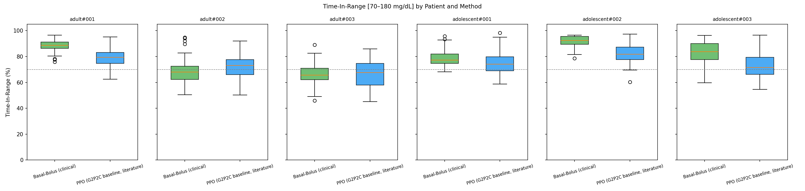
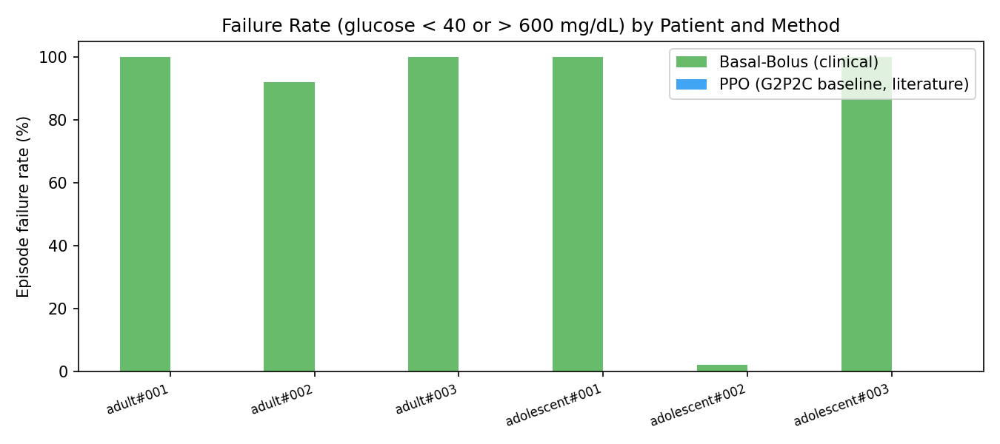
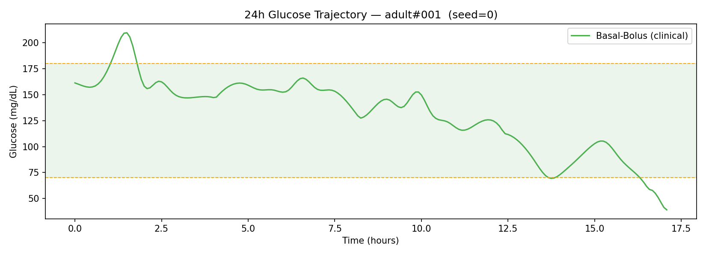
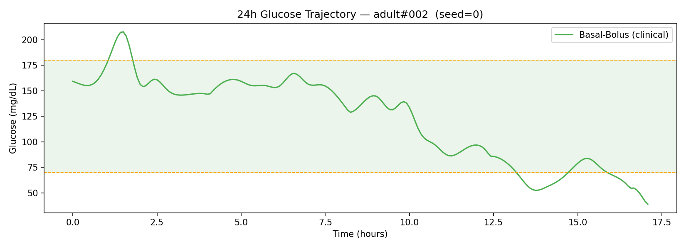

<!-- _paginate: false -->
<!-- _backgroundColor: #1A237E -->
<!-- _color: white -->

# Basal-Bolus vs Reinforcement Learning
## Contrôle automatique du dosage d'insuline : Diabète de Type 1

<br>

**Anass Bensmina · Moubarak Benaqqa · Karim Ait Salim**

Pr. Gasmini Manal · Pr. Rachid Oulad Haj Thami

ENSIAS · Génie de la Data · 2025/2026

---

## Le problème : maintenir la glycémie dans la zone cible

Le **Diabète de Type 1** : le pancréas ne produit plus d'insuline → la glycémie doit être gérée manuellement 24h/24.

| Zone | Glycémie | Risque |
|---|---|---|
| 🟢 Cible (TIR) | 70 – 180 mg/dL | Objectif |
| 🟡 Hypoglycémie | < 70 mg/dL | Malaise, convulsions |
| 🔴 Hypoglycémie sévère | **< 40 mg/dL** | Coma, décès |
| 🟠 Hyperglycémie | > 180 mg/dL | Complications à long terme |

<br>

<div class="highlight">
<strong>Défi central :</strong> maintenir la glycémie dans la fenêtre [70–180] en permanence, malgré les repas, l'activité physique et la variabilité inter-individuelle.
</div>

---

## Approche classique : le contrôleur Basal-Bolus

Norme de soin clinique actuelle, basée sur **3 composantes** :

```
Insuline totale = Basal  +  Bolus repas  +  Bolus correctif
```

| Composante | Formule | Rôle |
|---|---|---|
| **Basal** | 0.48 × DTJ / 24h | Couverture basale continue |
| **Bolus repas** | glucides / CIR | Couvre le repas annoncé |
| **Bolus correctif** | (G − 140) / FSI | Corrige l'hyperglycémie |

> CIR = 500/DTJ  ·  FSI = 1800/DTJ  ·  DTJ = dose totale journalière du patient

<br>

⚠️ **Contrainte forte :** le patient doit **annoncer ses repas** (quantité de glucides) avant chaque prise alimentaire.

---

## Notre approche : agent PPO sans annonce de repas

Un agent d'**Apprentissage par Renforcement** (PPO — Proximal Policy Optimization) apprend une politique de dosage par interaction avec un simulateur physiologique.

**Observation de l'agent** :
$$o_t = \bigl[\underbrace{G_t}_{\text{glycémie}},\; \underbrace{\sin(\omega t)}_{\text{heure cyclique}},\; \underbrace{\cos(\omega t)}_{\text{heure cyclique}}\bigr]$$

**Récompense** :
$$r_t = \mathbf{1}[70 \le G_t \le 180] \;-\; 0.1 \cdot \rho_{\text{Magni}}(G_t)$$

**Terminaison** avec pénalité −100 si G < 40 ou G > 600 mg/dL.

<div class="highlight">
L'agent <strong>n'a jamais accès aux glucides des repas</strong>. Il doit inférer les événements alimentaires depuis la glycémie et l'heure.
</div>

---

## Ce qui nous différencie — l'asymétrie d'information

C'est le cœur scientifique du projet :

| | Basal-Bolus | Agent PPO |
|---|:---:|:---:|
| Glycémie courante | ✅ | ✅ |
| Heure de la journée | ✅ | ✅ (sin/cos) |
| **Glucides du repas** | ✅ **Oui** | ❌ **Non** |
| Paramétrage manuel | Requis (DTJ) | Aucun |
| Adaptation au patient | Fixe | Appris (1 agent/patient) |

<br>

**Question de recherche :** un agent RL peut-il rivaliser avec un contrôleur clinique *qui a accès aux repas*, en apprenant uniquement depuis les signaux de glucose ?

---

## Protocole expérimental

**Simulateur** : SimGlucose — modèle UVA/Padova approuvé par la FDA

**Cohorte** : 6 patients (3 adultes + 3 adolescents)

**Protocole repas fixe** :
- 08h00 — Petit-déjeuner : 40 g de glucides
- 13h00 — Déjeuner : 80 g
- 20h00 — Dîner : 60 g

**Évaluation** : 50 épisodes × 24h par patient et par méthode

**Entraînement PPO** : 200 000 pas par patient (Stable-Baselines3, MlpPolicy 64×64 ReLU)

**Comparaison statistique** : test de Mann-Whitney U + taille d'effet Cohen *r*

---

## Métriques cliniques utilisées

| Métrique | Définition | Cible |
|---|---|---|
| **TIR** | % temps dans [70–180] mg/dL | > 70% |
| **TBR** | % temps < 70 mg/dL (hypoglycémie) | < 4% |
| **TAR** | % temps > 180 mg/dL (hyperglycémie) | < 25% |
| **LBGI** | Indice de risque hypoglycémique (Magni) | minimiser |
| **HBGI** | Indice de risque hyperglycémique (Magni) | minimiser |
| **CV** | Coefficient de variation glycémique | < 36% |
| **Taux d'échec** | % épisodes avec G < 40 ou G > 600 | **0%** |

<div class="highlight">
Le <strong>taux d'échec</strong> est la métrique de sécurité absolue : un seul passage sous 40 mg/dL dans un épisode de 24h suffit à le classer comme critique.
</div>

---

## Résultats — Time-In-Range par patient



---

## Résultats — Taux d'échec par patient



<div class="danger">
Le Basal-Bolus atteint 100% de taux d'échec sur 4 patients des 6 — chaque épisode contient au moins une glycémie < 40 mg/dL.
</div>

---

## Résultats — Tableau comparatif par patient

| Patient | Méthode | TIR (%) | TBR (%) | TAR (%) | Échec (%) |
|---|---|:---:|:---:|:---:|:---:|
| adult#001 | BB | **88.7** | 11.3 | **0.0** | 100 |
| adult#001 | PPO | 79.4 | **3.1** | 16.8 | **0** |
| adult#002 | BB | 67.9 | 32.1 | **0.0** | 92 |
| adult#002 | PPO | **73.1** | **7.4** | 21.3 | **0** |
| adult#003 | BB | 65.6 | **8.0** | **24.3** | 100 |
| adult#003 | PPO | **67.7** | 10.1 | 22.7 | **0** |
| adolescent#001 | BB | **77.2** | 21.1 | **0.0** | 100 |
| adolescent#001 | PPO | 74.0 | **6.0** | 20.0 | **0** |
| adolescent#002 | BB | **92.4** | **0.0** | **7.1** | 2 |
| adolescent#002 | PPO | 81.7 | 3.0 | 15.6 | **0** |
| adolescent#003 | BB | **83.8** | 7.9 | **8.6** | 100 |
| adolescent#003 | PPO | 71.5 | **7.1** | 17.7 | **0** |

---

## Résultats — Tests statistiques globaux (300 épisodes / méthode)

| Métrique | BB médiane | PPO médiane | Meilleur | p-value | Cohen r |
|---|:---:|:---:|:---:|:---:|:---:|
| TIR (%) | **80.87** | 74.81 | BB | < 0.001 | 0.231 |
| TBR (%) | 9.83 | **5.72** | PPO | < 0.001 | 0.336 |
| TAR (%) | **2.93** | 19.27 | BB | < 0.001 | 0.574 |
| LBGI | **2.40** | 2.59 | — | 0.447 | 0.031 |
| HBGI | **2.70** | 6.75 | BB | < 0.001 | 0.687 |
| Glycémie moy. | **134.6** | 147.9 | BB | < 0.001 | 0.431 |
| CV (%) | **27.6** | 29.8 | — | 0.060 | 0.077 |
| **Taux d'échec (%)** | 82.3 | **0.0** | **PPO** | — | — |

---

## Interprétation — Deux profils de risque opposés

<div class="danger">
<strong>Basal-Bolus :</strong> meilleur TIR moyen (+6 pts), moins d'hyperglycémie (TAR 2.9% vs 19.3%) — mais taux d'échec catastrophique de 82.3%. Les formules empiriques (règle des 500 / 1800) surestiment les besoins en insuline et provoquent des hypoglycémies sévères dans presque tous les épisodes.
</div>

<br>

<div class="success">
<strong>Agent PPO :</strong> TIR légèrement inférieur, plus d'hyperglycémie post-prandiale (sans accès aux repas) — mais taux d'échec de 0% sur l'ensemble des 300 épisodes. L'agent apprend spontanément à opérer dans une enveloppe sûre.
</div>

<br>

> **Tension fondamentale :** optimiser le TIR *ou* éliminer les épisodes catastrophiques ? Pour un dispositif médical, la sécurité absolue prime.

---

## Trajectoires glycémiques — adult#001



---

## Trajectoires glycémiques — adult#002



---

## Perspectives

**Safe RL**
Intégrer des contraintes de sécurité explicites (CMDP, barrières de Lyapunov) pour garantir TBR < 4% *et* TIR > 70% simultanément.

**Système hybride**
Combiner les deux approches : PPO pour la politique de fond + module BB en *override* lors des repas annoncés. Bénéfice attendu : 0% d'échec + réduction du TAR.

**Méta-apprentissage**
Entraîner un agent unique (MAML, Reptile) capable de s'adapter rapidement à un nouveau patient sans ré-entraînement complet.

**Robustesse aux repas aléatoires**
Remplacer le protocole de repas fixe par des horaires stochastiques pour tester la généralisation à des scénarios réels.

**Validation sur données réelles**
Tester la politique apprise sur le dataset OhioT1DM (12 patients réels avec CGM continu).

---

<!-- _backgroundColor: #1A237E -->
<!-- _color: white -->

## Conclusion

<br>

| | Basal-Bolus | Agent PPO |
|---|:---:|:---:|
| TIR global | ✅ **80.87%** | 74.81% |
| Hypoglycémie (TBR) | 9.83% | ✅ **5.72%** |
| Hyperglycémie (TAR) | ✅ **2.93%** | 19.27% |
| **Sécurité absolue** | ❌ 82.3% d'échec | ✅ **0% d'échec** |

<br>

> Un agent RL entraîné *sans* annonce de repas n'égale pas le Basal-Bolus sur le TIR, mais le surpasse sur la sécurité opérationnelle — résultat cliniquement pertinent pour les pancréas artificiels de prochaine génération.
